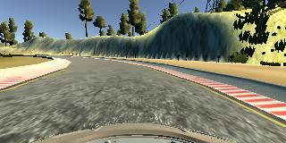

[//]: # (Image references)

[slika_bg]: https://www.elegantthemes.com/blog/wp-content/uploads/2020/12/divi-video-parallax-overlay-featured-image.jpg
[image1]: https://img.youtube.com/vi/2b2LPtljqdA/0.jpg
[image2]: https://img.youtube.com/vi/2b2LPtljqdA/0.jpg
[image3]: https://img.youtube.com/vi/2b2LPtljqdA/0.jpg


# Project Documentation
---

## Introduction


|Video 1| Video 2| Video 3 |
|----|---|-----|
| [![image1]](https://www.youtube.com/watch?v=2b2LPtljqdA) | [![image2]](https://www.youtube.com/watch?v=2b2LPtljqdA) | [![image3]](https://www.youtube.com/watch?v=2b2LPtljqdA)|


**This is official implementation of *Resnet50* neural network**

> Neural network is the best algorithm that human kind ever invented  
> *By Nekoj So Ime i prezime*


The following modules were part of Data Science academy 

1. Big Data
2. Machine Learning
    - Neural Networks
    - PCA
    - TSNE
    - K-Means
    - Sk-Learn
3. Python
    - For loops
    - While loops
    - if/else


The most useful code snippet that improved our accuracy was the foolowing : 
 
```
sum = 0
for i in range(200):
    print("hello world", i)
    sum = sum+i

b = 100
a = 100
```
------

## Accuracy 

### Graphics
![slika_bg]

  

<p align = "center">

</p>
  
[Link](http://brainster.co)

### Table 
|Split type| Accuracy | ROC |
|----|---|-----|
| Train | 78 | 64|
| Test| 92 | 47|


Here's a sentence with a footnote. [^1]
[^1]: This is the footnote


## Conclusion 

The following bugs were fixed : 
 * ~~Unusual crash~~
 * ~~No memory leaks~~

We tried sevral algorithms for training machine learning models:
 - [x] Xception
 - [X] Resnet50
 - [ ] VGG
 - [ ] DenseNet  
